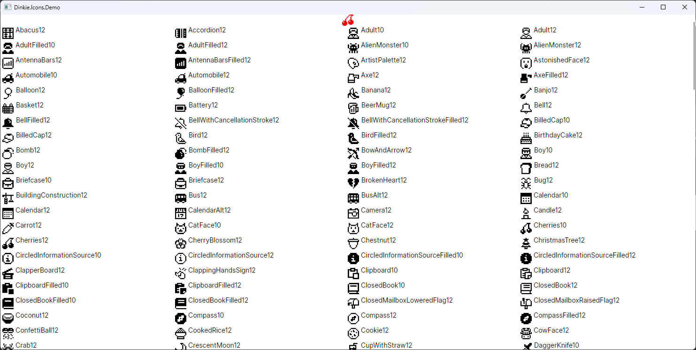

# Dinkie Icons for Avalonia

Avalonia Implementation for [Dinkie Icons](https://github.com/atelier-anchor/dinkie-icons)

as described in original repo, this is WIP. 

## Usage

```xaml
<Window
    ...
    xmlns:icons="clr-namespace:Dinkie.Icons;assembly=Dinkie.Icons">
    <icons:DinkieIcon Foreground="Red" IconName="Cherries12" />
</Window>
```

## Glance

